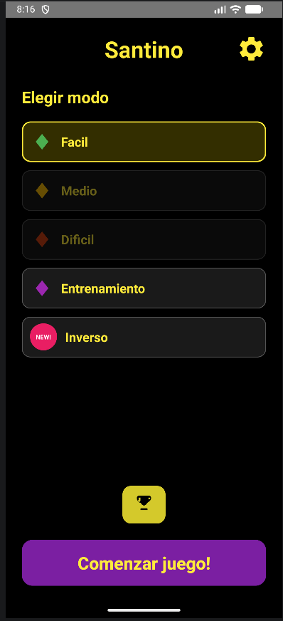
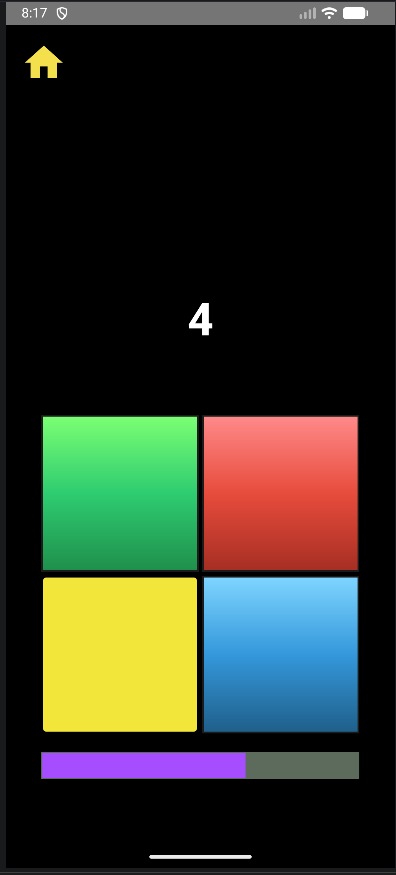
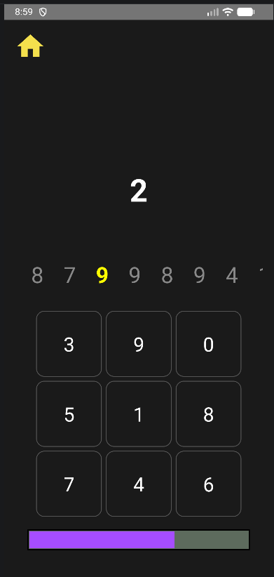
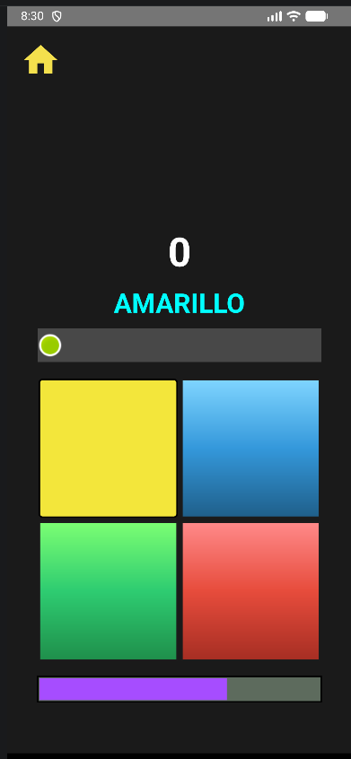
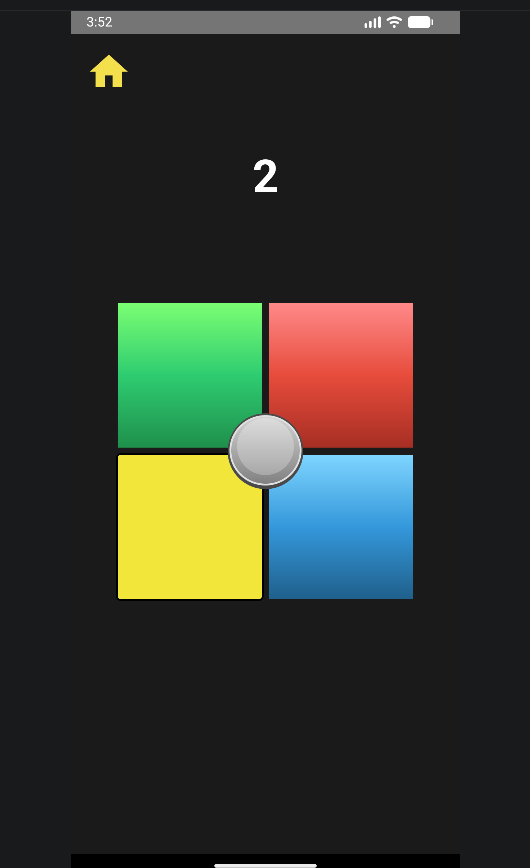
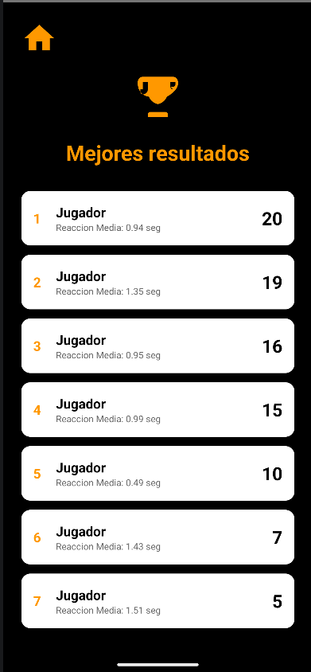

**Mobile reaction-training game designed to challenge memory, attention, and cognitive control through multiple fast-paced game modes and performance tracking**

## Features:

* Multiple difficulty levels and game modes
* Simon memory challenge
* Number-based reaction mode
* Stroop-inspired selective attention challenge
* Inverse reaction mode
* User settings and customization
* Statistics and local score tracking

## Screenshots

  
  
  

  
  
  

